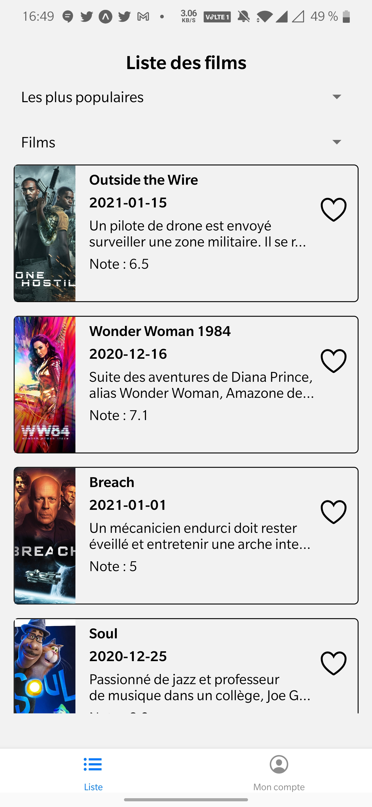
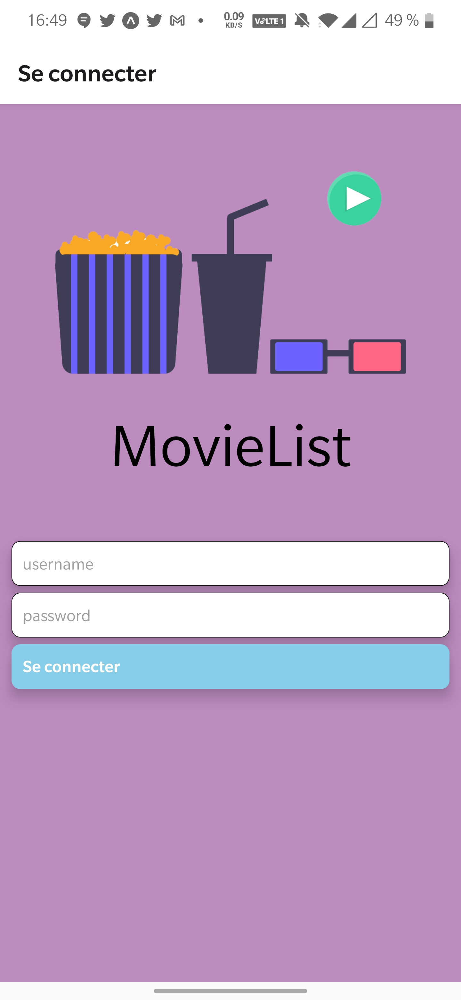
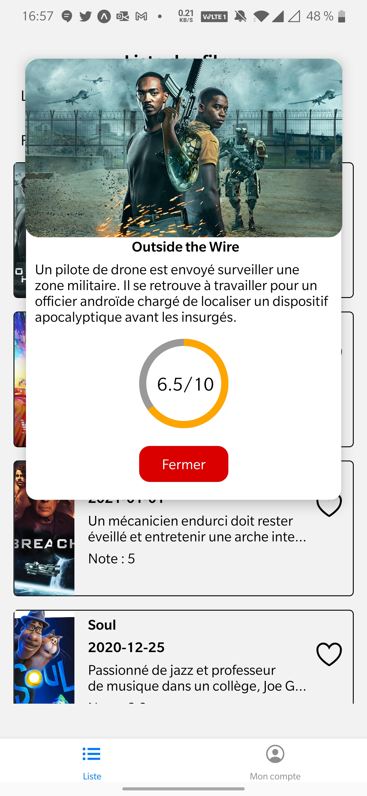
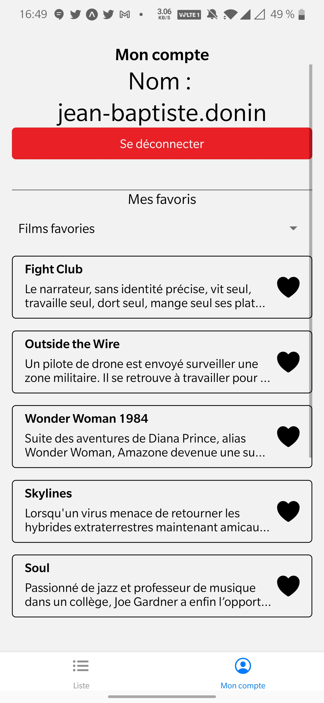

# Application Mobile MovieList
Cette application mobile permet d'avoir une liste de films/series basé sur The Movie DB.
<div>

</div>
## Installation de l'application:

* Allez sur le github: https://github.com/doninj/MovieList
* faite un **git clone** pour récuperer le dossier de l'application.
* Faites dans le projet:  ``` npm install ``
* Faites un ```yarn android ``` pour lancer le projet.
**Ou** Allez sur : https://expo.io/@doninj/projects/MovieList et scanner le qr code. 
## Fonctionnement de l'application:

Dans cette application, il faut avoir un compte The Movie Db pour y accèder.
Il a as 2 sections: une liste de film/serie et une de compte avoir les favories.



### Différentes pages

<div flex="1">

</div>

Dans la page de login, il est possible:
* de se connecter avec son mot de passe et identifiant du site.
* Lors se que l'on change d'application ou on ferme l'application, il vous connecte automatiquement.

### Page liste:
<div flex="1">


</div>

* _Avoir une liste de films et de series avec des filtres._
* _Avoir un détails d'un film._
* _Filtrer selon les plus populaire,les mieux notés,les dernières sorties._
* _Mettre en favorie un film/serie
### Page de profil:
<div flex="1">

</div>

* _Avoir son nom d'utilisateur_
* _ Avoir sa liste de favorie/serie


  


